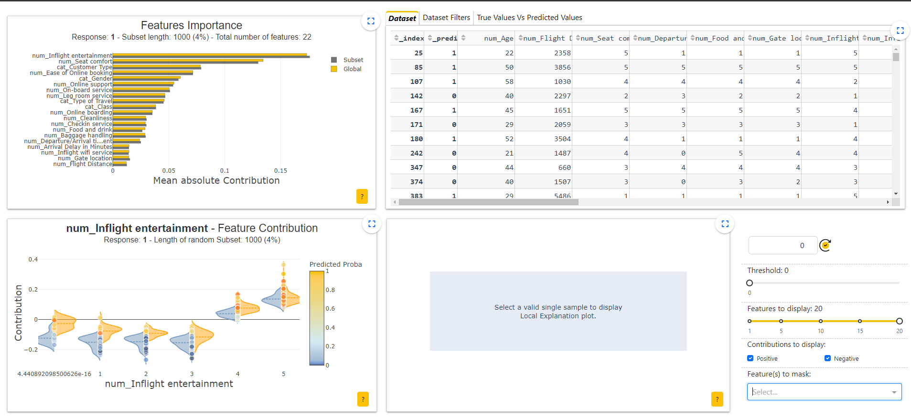

# Sentiment-Analysis
# Notebook Jupyter : sentiment-analysis.ipynb 🗒️
# Notebook Shapash : shapash-test.ipynb 🤷🏻‍♂️
# App Streamlit : Home.py et dossier pages 📲
# App déployé : [Streamlit](https://airline.streamlit.app/) ☁️
# App Shapash

